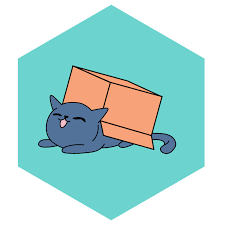

## GUIDE FOR CATS LIBRARY:

### tl;dr
Cats is a library which provides abstractions for functional programming to Scala.  
It adds type-classes (which are abstract & generic), which adds functionality to existing types & libraries without using Object Orientated inheritance.  
In Object Orientated languages (e.g. Java), where extension methods aren't a feature of the language, the way to extend functionality to a specific class (e.g. Strings) would be to create a new class that inherits from this class (e.g Strings) and adds on these new user-created methods.  
However, with Scala & Cats, this isn't necessary as we can use Cat's type-classes and implicit implementations of these type-classes for the types/classes we want to extend the functionality of.

### Overview of the Components in the Cats Ecosystem:
* Abstract type classes & their methods (e.g. Monad, Functor, Applicative, Semigroup) - "_Code to abstractions not concrete implementations_"
* Data types - Real world data structures/types that each have their own functionality & use-cases
* Cats Effects - Adds onto the Cats Library with extra type-classes & data-types, dealing with concurrency, parallelism and running fibers. 

### #1 - Docs Folder:
Contains the guide documents.

### #2 - Start Folder:
Contains a short demo on why type-classes are useful and a demo on how to use Monads.

### #3 - Type Class Folder:
 * Within each Create Folder:
   * Describes what each type-class does and provides a simplified API for each.  
 
 * Within each Implementations Folder:
   * Defines implementations for thi type-class, for different data structures
   * All of this is already built-in to the Cats library, so the user doesn't have to define these in their code.

 * Within each Using Folder:
   * Provides an example of how each type class is used

### #4 - Data types Folder:
For each data type that Cats provides, describes what each does and provides an example of using it.
