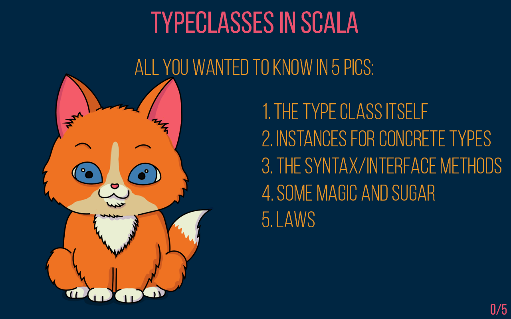
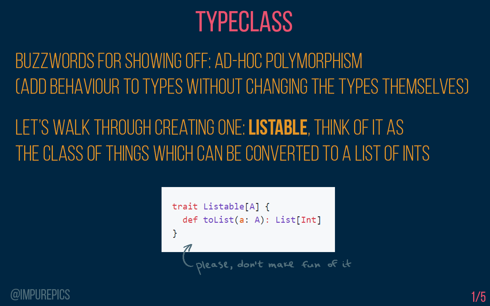
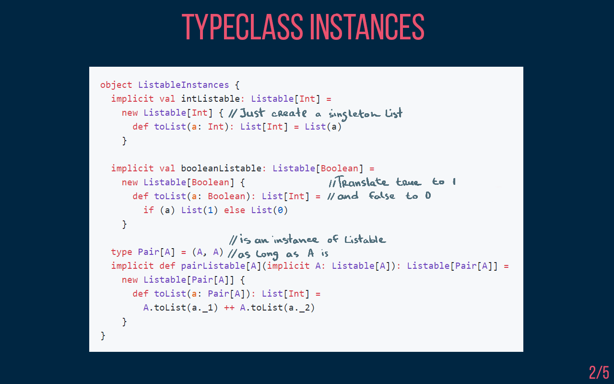
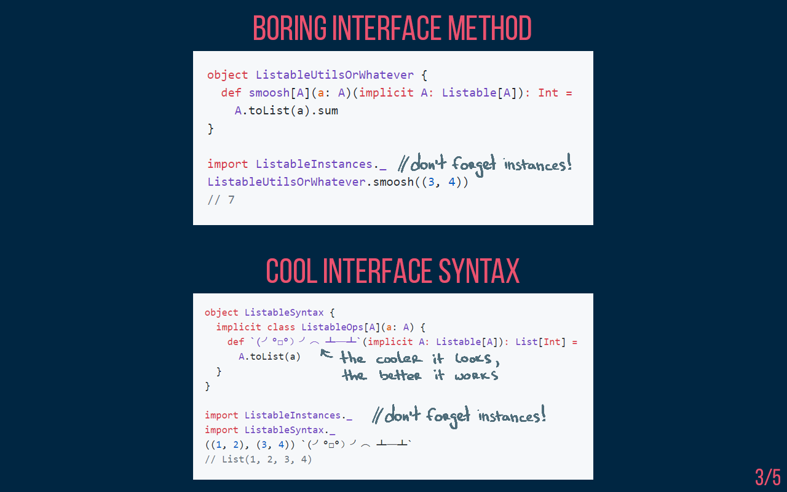
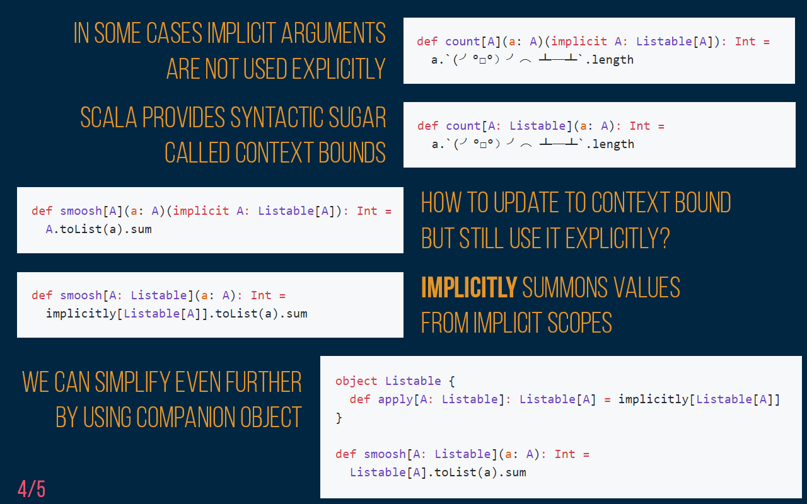
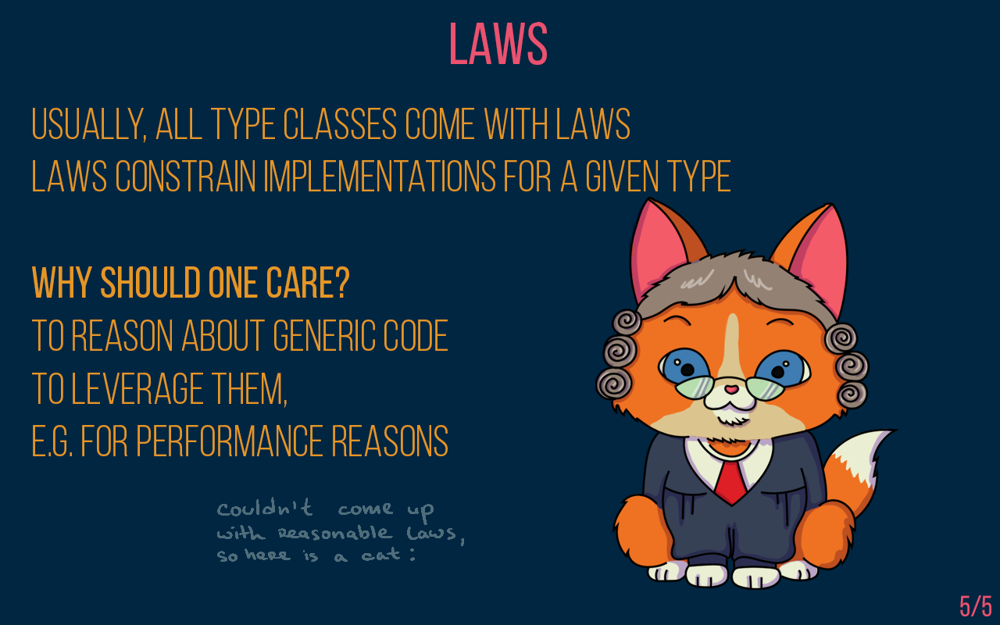

# Overview of Type Classes in Cats:

### 1) The generic / abstract type-class, with its generic methods

### 2) Implementations/instances of this type-class for 'concrete' data-types (e.g. for List, Option, Either)
Note: Below syntax ("implicit" keyword) is Scala 2

Put all these implementations/instances into an object so it can be easily imported to other files

Different syntax for the same thing: Implicits/Using-with or Context Bounds

### 3) Laws that each type-class must follow
Note: Type-classes inherit both methods and laws from it's 'parent interfaces'

