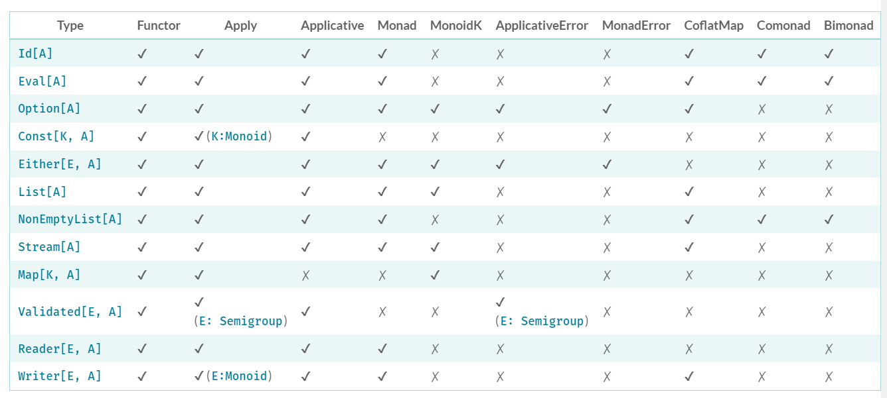

# Data Types:

* Are data-structures that have their own functionality and implement type-classes.
* Each have their own specific use-cases

The type-classes that each data-type implements

**Note:**  
Cats also provides Monad Transformers:
* Used when the monad is wrapped inside another type (e.g. Future[Option[Int]] == OptionT[Future, Int] )
* Denoted by the suffix T, e.g:
  * EitherT composes Either with other monads
  * OptionT composes Option with other monads